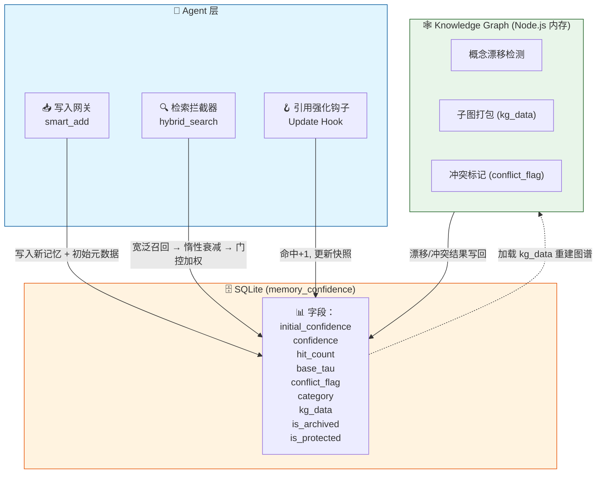

# OpenClaw Memory System v1.3

> **存算分离 · 惰性衰减 · 实证强化**  
> 为 AI Agent 构建的 SQLite 增强型长期记忆系统，具备置信度生命周期管理、知识图谱双轨融合与混合门控检索。

---

## 🧠 核心理念

传统 RAG 记忆系统在"查询时"被动搜索原始日志，容易陷入**语义冗余、置信度缺失、知识僵尸化**三大陷阱。

记忆引擎v1.2以agentmemory和knowledge graph为基础 借鉴认知科学中的**间隔重复效应**与**遗忘曲线**，将记忆管理升级为**主动生命周期治理**：

- **写入时编译**：信息入库即赋予初始置信度与半衰期，不同类别走不同遗忘曲线
- **检索时惰性衰减**：不写库、不刷表，仅在召回瞬间实时计算时间衰减
- **引用时才强化**：只有被 Agent 实际采纳的记忆才增加权重，杜绝噪音虚假繁荣
- **双轨融合**：SQLite 作为持久真相来源，Node.js 知识图谱作为内存抽象引擎

---

## 🏗️ 架构概览

## 🔬 核心算法

### 动态半衰期（间隔重复）

记忆被反复引用后，遗忘速度指数级下降，但巩固有生理上限：

$$\tau(\text{hits}) = \tau_{\min} + (365 - \tau_{\min}) \cdot (1 - e^{-0.3 \cdot \text{hits}})$$

| 命中次数 (hits) | 半衰期 τ (base_tau=7) | 半衰期 τ (base_tau=30) |
|:---:|:---:|:---:|
| 0 | 7 天 | 30 天 |
| 3 | 67 天 | 145 天 |
| 5 | 121 天 | 215 天 |
| 10 | 266 天 | 318 天 |
| ∞ | 365 天 | 365 天 |

### 实时置信度衰减

$$\text{Conf}_{\text{realtime}} = \max\left(0,\ \text{Conf}_{\text{snapshot}} \cdot e^{-\frac{\Delta t}{\tau(\text{hits})}} - \text{Penalty}_{\text{conflict}}\right)$$

### 混合门控排序

抛弃暴力的向量相似度 × 置信度乘法，采用门控过滤 + 加权求和：

$$\text{Score}_{\text{final}} = 0.7 \cdot \text{Sim} + 0.3 \cdot \text{Conf}_{\text{realtime}}$$

语义相似度低于 0.55 的直接淘汰，不参与后续排序。

---

## 📊 记忆分级法则

不同来源的记忆，从出生起就走不同的遗忘曲线：

| 类别 | 初始置信度 | 基础半衰期 | 典型场景 |
|:---|:---:|:---:|:---|
| `temporary` | 0.40 | 2 天 | 临时变量、单次任务 |
| `raw_log` | 0.50 | 7 天 | 日常对话、未提炼想法 |
| `episodic` | 0.70 | 30 天 | 情节摘要、会话总结 |
| `preference` | 0.70 | 30 天(→90) | 用户习惯、**自动从raw_log升级** |
| `kg_node` | 0.85 | 90 天 | 图谱提炼的结构化结论 |
| `user_identity` | 0.95 | 365 天 | 核心身份、受保护信息 |

> **自动分类升级**: `smart_add` 可识别配置关键词（API key、voice ID、model名、文件路径等），自动将 `raw_log` 提升为 `preference` 类别。

---

## ⚡ 关键设计决策

| 决策 | 说明 |
|:---|:---|
| **惰性衰减** | 时间流逝不消耗 I/O。仅在检索或归档时，基于 `last_confidence_update` 实时计算衰减 |
| **禁止心跳写回** | 指数衰减 $e^{-(t_1+t_2)} = e^{-t_1}e^{-t_2}$ 数学上连续，心跳写回不改变衰减曲线，但会污染字段语义。心跳仅标记 `is_archived` |
| **引用强化** | 检索 ≠ 记忆强化。仅 LLM 返回的 `cited_memory_ids` 触发 `hit_count+1` 和置信度 +0.1 |
| **冲突双链路** | 快速链路：图谱概念漂移 → 直接打标；慢速链路：心跳 LLM 扫描历史矛盾 |
| **子图容器** | KG 结论以 `{"core_concept","triplets":[...]}` 格式存入 `kg_data`，重启时完整重建内存图谱 |

---

## ✨ v1.2 新增特性 (2026-05-16)

### FTS5 并行召回
利用 OpenClaw 原生 `chunks_fts` 虚拟表，在向量搜索的同时并行执行 FTS5 BM25 全文搜索。专有名词、代码库名、API 名称等关键词精准命中，弥补纯语义搜索短板。

### RRF 三通道融合
搜索请求并行发送至 **向量语义 → FTS5 关键词 → KG 概念桥** 三个独立检索器，结果以 Reciprocal Rank Fusion (k=60) 等权融合排序。≥3 通道时 `rrf_multi`，2 通道时 `rrf_dual`。

### 情节摘要中间层 (Episodic Memory)
`summarize` 命令汇聚 raw_log 日志，通过 LLM 生成情节摘要（fallback 关键词摘要），存为 `episodic` 类别（τ=30 天）。`kg_data` 存储 `episode_of` 链接原始 chunk ID，支持 `drill <chunk_id>` 下钻查看原文。搜索含时间意向词（上次/昨天/回顾）时，episodic 结果 RRF 自动加权 +0.1。

### 检索管线演进
| 版本 | 检索方式 |
|:---|:---|
| v1.0 | 单通道：向量 + 置信度加权 |
| v1.1 | 双通道：向量 + FTS5（简单并集） |
| **v1.2** | **三通道：向量 + FTS5 + KG → RRF 融合** |

### v1.3 (2026-05-18) — 插件合约 + session 检查点

- **Plugin contracts** — 声明 `contracts: { tools: true }` 和工具名，完善 OpenClaw 插件注册
- **image_vision 工具** — 注册到 memory-engine 插件，调用 Qwen3-VL-32B-Instruct 识别图片
- **session-checkpoint.js** — 新脚本：每日 03:55 提取配置 → 写 preference → 生成 episode → 标记冲突
- **detectConfig()** — smart_add 中自动检测配置关键词，将 raw_log 升级为 preference
- **冲突自动标记** — 同 key 配置只保留最新，旧条目设 conflict_flag=1
- **Prompt Supplement** — 动态注入昨日 episode + 受保护记忆，session 启动即 warm-start

